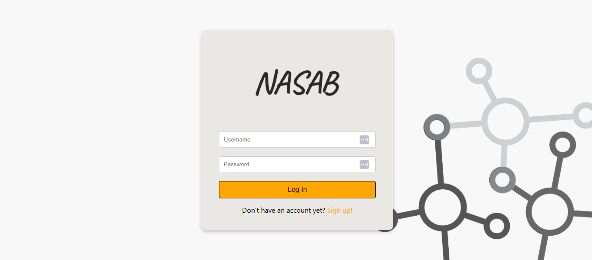
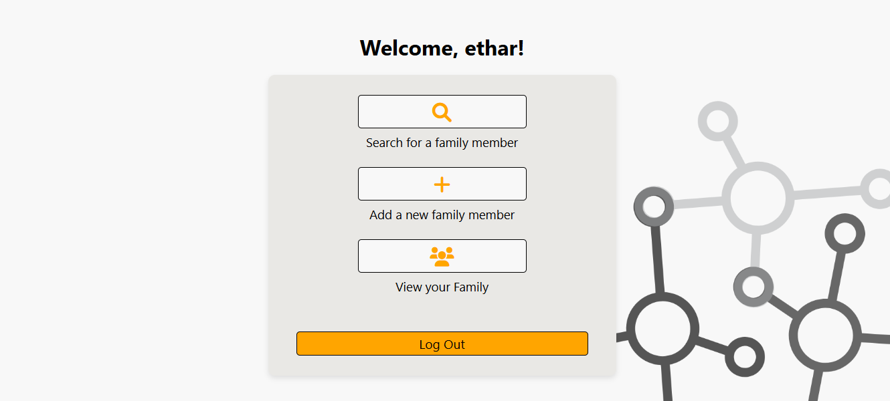
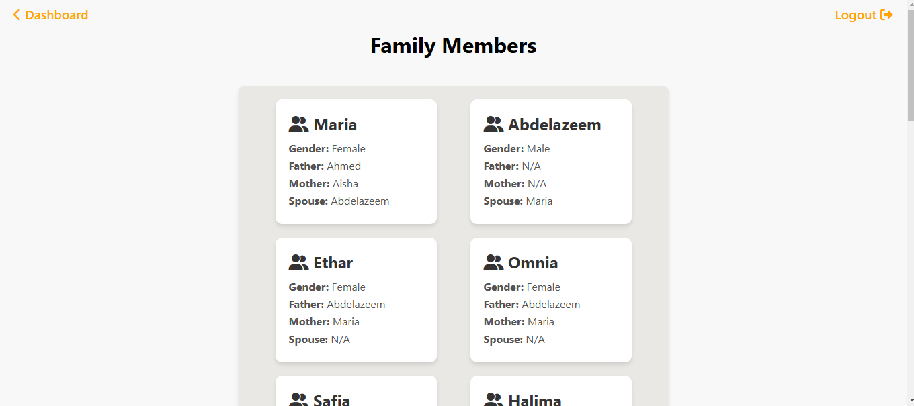

# Nasab Family Tree Web Application

## Project Overview
Nasab is a web-based family tree application that allows users to create, manage, and explore family relationships in an easy-to-use interface. The application enables users to register, view, and search for family members, and visualize relationships like parent-child, spouse, and more.

---

## Features
- **User Registration & Authentication**: Secure user registration and login functionality.
- **Add Family Members**: Add and define relationships for family members.
- **View Family Profile**: View all family members and their associated relationships.
- **Search Functionality**: Search for family members and see their relationship to the user.
- **Dynamic UI**: Real-time updates and responsive design using Vue.js.
- **CRUD Operations**: Full support for creating, reading, updating, and deleting family members.

---

## Tech Stack
- **Frontend**: JavaScript, HTML, CSS
- **Backend**: Flask, SQLAlchemy, Flask-Login
- **Database**: MySQL
- **Version Control**: Git, GitHub

---

## Installation
Since we are yet to deploy, here is what you can do:
### Prerequisites
- **Python 3.x** (preferably 3.8 or higher)
- **Node.js** (for frontend development)
- **MySQL** (for database)

### Steps

1. **Clone the repository**:
   ```bash
   git clone https://github.com/etharabdelazeem/nasab.git
   cd nasab
   ```

2. **Create a virtual environment**:
   ```bash
   python3 -m venv venv
   source venv/bin/activate  # For macOS/Linux
   venv\Scripts\activate     # For Windows
   ```

3. **Install Python dependencies**:
   ```bash
   pip install -r requirements.txt
   ```

4. **Install frontend dependencies**:
   ```bash
   npm install
   ```

5. **Set up the MySQL database**:
   - Start MySQL and log in:
     ```bash
     mysql -u root -p
     ```
   - Create the database:
     ```sql
     CREATE DATABASE nasab_db;
     ```
   - Run migrations:
     ```bash
     flask db upgrade
     ```

6. **Run the application**:
   ```bash
   flask run
   ```

   The app will be available at `http://127.0.0.1:5000`.

---

## Usage
1. **Register an Account**: Sign up to create an account.
2. **Add Family Members**: Add new family members and define their relationships.
3. **View Family Profile**: Explore all family members and their relationships on the "Family" page.
4. **Search for Family Members**: Use the search bar to find specific family members and their relationship to you.

---

## Contributing
We welcome contributions to the Nasab project! To contribute:

1. Fork the repository.
2. Create a new branch:
   ```bash
   git checkout -b feature-name
   ```
3. Commit your changes:
   ```bash
   git commit -m "Description of changes"
   ```
4. Push to the branch:
   ```bash
   git push origin feature-name
   ```
5. Open a pull request to the `main` branch.

---

## License
This project is not yet licensed.

---

## Acknowledgements
- **Vue.js**: For a reactive frontend framework.
- **Flask**: For a lightweight backend framework.
- **SQLAlchemy**: For ORM database interaction.
- **Font Awesome**: For icons used in the UI.

---

## Future Enhancements
- **Mobile Optimization**: Enhancing the UI for mobile devices.
- **Graphical Family Tree**: Adding visual representation for family trees.
- **Advanced Search**: Supporting relationship filters in searches.

---

## Screenshots
### Login Page


### Dashboard


### Family Page

